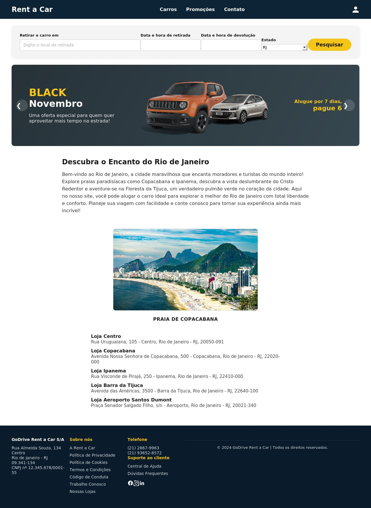

# Rent a Car

Sistema web de aluguel de carros, desenvolvido como projeto acadêmico da disciplina de Desenvolvimento de Aplicações WEB. A aplicação cobre toda a jornada do usuário: cadastro, busca de veículos com filtros, reserva com cálculo dinâmico de preço, aplicação de cupons e confirmação de pagamento.

<!-- Substitua pelo caminho de um print ou GIF navegando pela aplicação -->

## Funcionalidades

- Cadastro e login de usuário com autenticação via sessão PHP
- Busca de veículos com filtros por categoria, passageiros, câmbio, combustível e cor
- Página de detalhe do carro com seleção de proteção e itens adicionais
- Cálculo dinâmico do valor da reserva, incluindo promoções e cupons de desconto
- Fluxo completo de pagamento e confirmação de reserva
- Perfil de usuário com edição de dados e foto

## Tecnologias

- **Front-end:** HTML5, CSS3, JavaScript
- **Back-end:** PHP (arquitetura Controller/View)
- **Banco de dados:** MySQL (via PDO)

## Como rodar (XAMPP)

1. Copie a pasta `rent-a-car` para `htdocs` (ex: `C:\xampp\htdocs\rent-a-car`).
2. No **phpMyAdmin**, crie o banco executando `sql/schema.sql` — ele já cria o banco `rent_a_car`, as tabelas e os dados iniciais (lojas, carros, proteções, adicionais e cupons).
3. Confira as credenciais em `includes/config.php` (padrão do XAMPP: usuário `root`, senha vazia).
4. Inicie o Apache e o MySQL no painel do XAMPP.
5. Acesse `http://localhost/rent-a-car/index.php`.

## Arquitetura

O projeto segue uma separação Controller/View:

- **Controllers** (raiz do projeto: `index.php`, `home.php`, `carros.php`, etc.) — contêm apenas lógica PHP: sessão, consultas ao banco, validações e cálculos. Ao final, cada um faz um `require` para sua view correspondente.
- **Views** (pasta `views/`) — contêm apenas HTML, com o mínimo de PHP necessário para exibir os dados já preparados pelo controller (`echo`, `foreach`, `if` simples de exibição). Cada view segue o padrão `nome.view.php`.
- **Partials** (`views/partials/`) — `header.php` e `footer.php`, reaproveitados nas views.
- **`includes/config.php`** — conexão com banco, sessão e funções auxiliares de autenticação.
- **`api/`** — endpoints que processam formulários (login, cadastro, pagamento etc.), sem HTML.

## Decisões técnicas

- **Reserva em duas etapas:** a seleção de proteção, adicionais, datas e loja é calculada e mantida temporariamente na sessão PHP (`$_SESSION['reserva_pendente']`). A reserva só é gravada nas tabelas `reservas` e `reserva_adicionais` após a confirmação do pagamento.
- **Contador de resultados dinâmico:** a lista de carros exibe a contagem real de veículos cadastrados no banco (variando conforme os filtros aplicados), com busca por nome e ordenação por preço.
- **Capacidade de bagagem estimada:** calculada a partir da capacidade em litros do porta-malas de cada carro, já que não havia um número exato de malas cadastrado.
- **Promoção "Black Nov":** implementada como uma diária gratuita a partir de 7 diárias reservadas.
- **Adicionais com quantidade:** itens como cadeirinha infantil e locatário jovem funcionam com seletor de quantidade, multiplicando o valor diário pelo número de itens selecionados.
- **Dados do perfil:** o CPF é bloqueado para edição após o cadastro; o número da CNH pode ser preenchido manualmente no perfil, já que o cadastro inicial coleta apenas a foto do documento.

## Status

Todas as páginas da jornada do usuário estão implementadas e funcionais: login, cadastro, home, listagem de carros, detalhe/reserva, pagamento, confirmação e perfil.
